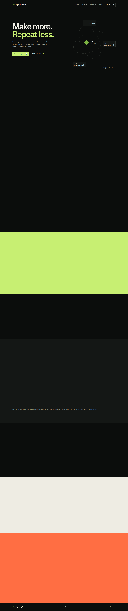

# Signal Systems

[](https://github.com/Dewyndl/ai-content-systems-landing/actions/workflows/ci.yml)

A conversion-focused storefront for practical AI content systems. The site presents implementation offers, separates automation from human judgement, and captures qualified enquiries through a server-side webhook boundary.



## What it does

- Presents Telegram, YouTube, approval, and custom content-system offers.
- Explains delivery scope, recurring infrastructure costs, and human review.
- Validates enquiries on the server with a honeypot and per-IP rate limiting.
- Sends normalized `signal.lead.created` events to a private webhook.
- Ships a portable Vite frontend, a dependency-free Node server, and a Vercel-compatible endpoint.
- Includes SEO fundamentals, privacy copy, responsive behavior, and accessible interactions.

## Architecture

```text
Browser
  ├─ offer catalogue and pricing
  ├─ accessible interactions
  └─ enquiry form
          │ POST /api/leads
          ▼
Lead boundary
  ├─ validation and consent
  ├─ honeypot and rate limit
  ├─ normalized event payload
  └─ server-side webhook delivery
```

The browser never receives the webhook URL or provider credentials. A successful response is returned only after the configured webhook accepts the lead.

## Run locally

Requirements: Node.js 18+ and npm.

```bash
npm install
npm run dev
```

For the production bundle and local delivery server:

```bash
cp .env.example .env
npm run build
npm start
```

The server listens on `http://localhost:4173` by default. Set `PORT` to override it and `LEAD_WEBHOOK_URL` to enable lead delivery. Without a webhook, valid submissions fail explicitly instead of being reported as delivered.

## Verification

```bash
npm test
npm run build
```

The tests cover validation, consent, bot-field rejection, rate limiting, privacy-safe payload construction, and webhook delivery.

## Deployment

The frontend can be deployed as a standalone Vite application, embedded into a Tilda Zero Block or HTML block, or paired with `api/leads.js` on Vercel. Before public launch:

- replace the placeholder domain in metadata, `robots.txt`, and `sitemap.xml`;
- configure `LEAD_WEBHOOK_URL` as a server-side secret;
- provide final legal contact details and privacy wording;
- add the final social preview image;
- test the production form against the chosen CRM or webhook endpoint.

## Documentation

The full implementation record, content model, interaction contract, deployment checklist, and acceptance status are in [docs.md](docs.md).
